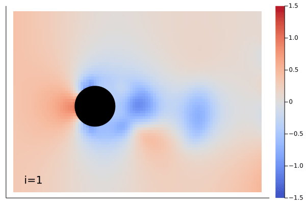

# NeuralOperators

| **Documentation** | **Build Status** | **Style** |
|:-----------------:|:----------------:|:---------:|
| [![doc stable badge]][doc stable link] | [![ci badge]][ci link] [![codecov badge]][codecov link] | [![style badge]][style link] |

[doc stable badge]: https://img.shields.io/badge/docs-stable-blue.svg
[doc stable link]: http://neuraloperators.sciml.ai/stable/

[ci badge]: https://github.com/SciML/NeuralOperators.jl/actions/workflows/CI.yml/badge.svg
[ci link]: https://github.com/SciML/NeuralOperators.jl/actions/workflows/CI.yml
[codecov badge]: https://codecov.io/gh/SciML/NeuralOperators.jl/branch/master/graph/badge.svg
[codecov link]: https://codecov.io/gh/SciML/NeuralOperators.jl
[style badge]: https://img.shields.io/static/v1?label=code%20style&message=SciML&color=9558b2&labelColor=389826
[style link]: https://github.com/SciML/SciMLStyle

| **Ground Truth** | **Inferenced** |
|:----------------:|:--------------:|
|  |  |

The demonstration showing above is Navier-Stokes equation learned by the `MarkovNeuralOperator` with only one time step information.
Example can be found in [`example/FlowOverCircle`](example/FlowOverCircle).

## Abstract

Neural operator is a novel deep learning architecture.
It learns a operator, which is a mapping between infinite-dimensional function spaces.
It can be used to resolve [partial differential equations (PDE)](https://en.wikipedia.org/wiki/Partial_differential_equation).
Instead of solving by finite element method, a PDE problem can be resolved by training a neural network to learn an operator mapping
from infinite-dimensional space (u, t) to infinite-dimensional space f(u, t).
Neural operator learns a continuous function between two continuous function spaces.
The kernel can be trained on different geometry, which is learned from a graph.

**[Fourier neural operator](src/model.jl)** learns a neural operator with Dirichlet kernel to form a Fourier transformation.
It performs Fourier transformation across infinite-dimensional function spaces and learns better than neural operator.

**[Markov neural operator](src/model.jl)** learns a neural operator with Fourier operators.
With only one time step information of learning, it can predict the following few steps with low loss
by linking the operators into a Markov chain.

**[DeepONet operator](src/DeepONet.jl)** (Deep Operator Network) learns a neural operator with the help of two sub-neural net structures described as the branch and the trunk network.
The branch network is fed the initial conditions data, whereas the trunk is fed with the locations where the target(output) is evaluated from the corresponding initial conditions.
It is important that the output size of the branch and trunk subnets is same so that a dot product can be performed between them.

## Usage

### Fourier Neural Operator

```julia
model = Chain(
    # lift (d + 1)-dimensional vector field to n-dimensional vector field
    # here, d == 1 and n == 64
    Dense(2, 64),
    # map each hidden representation to the next by integral kernel operator
    OperatorKernel(64=>64, (16, ), FourierTransform, gelu),
    OperatorKernel(64=>64, (16, ), FourierTransform, gelu),
    OperatorKernel(64=>64, (16, ), FourierTransform, gelu),
    OperatorKernel(64=>64, (16, ), FourierTransform),
    # project back to the scalar field of interest space
    Dense(64, 128, gelu),
    Dense(128, 1),
)
```

Or one can just call:

```julia
model = FourierNeuralOperator(
    ch=(2, 64, 64, 64, 64, 64, 128, 1),
    modes=(16, ),
    σ=gelu
)
```

And then train as a Flux model.

```julia
loss(𝐱, 𝐲) = l₂loss(model(𝐱), 𝐲)
opt = Flux.Optimiser(WeightDecay(1f-4), Flux.Adam(1f-3))
Flux.@epochs 50 Flux.train!(loss, params(model), data, opt)
```

### DeepONet

```julia
# tuple of Ints for branch net architecture and then for trunk net,
# followed by activations for branch and trunk respectively
model = DeepONet((32, 64, 72), (24, 64, 72), σ, tanh)
```
Or specify branch and trunk as separate `Chain` from Flux and pass to `DeepONet`

```julia
branch = Chain(Dense(32, 64, σ), Dense(64, 72, σ))
trunk = Chain(Dense(24, 64, tanh), Dense(64, 72, tanh))
model = DeepONet(branch, trunk)
```

You can again specify loss, optimization and training parameters just as you would for a simple neural network with Flux.

```julia
loss(xtrain, ytrain, sensor) = Flux.Losses.mse(model(xtrain, sensor), ytrain)
evalcb() = @show(loss(xval, yval, grid))

learning_rate = 0.001
opt = Adam(learning_rate)
parameters = params(model)
Flux.@epochs 400 Flux.train!(loss, parameters, [(xtrain, ytrain, grid)], opt, cb=evalcb)
```

## Examples

PDE training examples are provided in `example` folder.

### One-dimensional Fourier Neural Operator

[Burgers' equation](example/Burgers)

### DeepONet implementation for solving Burgers' equation

[Burgers' equation](example/Burgers/src/Burgers_deeponet.jl)

### Two-dimensional Fourier Neural Operator

[Double Pendulum](example/DoublePendulum)

### Markov Neural Operator

[Time dependent Navier-Stokes equation](example/FlowOverCircle)

### Super Resolution with MNO

[Super resolution on time dependent Navier-Stokes equation](example/SuperResolution)

## References

- [Fourier Neural Operator for Parametric Partial Differential Equations](https://arxiv.org/abs/2010.08895)
  - [zongyi-li/fourier_neural_operator](https://github.com/zongyi-li/fourier_neural_operator)
- [Neural Operator: Graph Kernel Network for Partial Differential Equations](https://arxiv.org/abs/2003.03485)
  - [zongyi-li/graph-pde](https://github.com/zongyi-li/graph-pde)
- [Markov Neural Operators for Learning Chaotic Systems](https://arxiv.org/abs/2106.06898)
- [DeepONet: Learning nonlinear operators for identifying  differential equations based on the universal approximation theorem of operators](https://arxiv.org/abs/1910.03193)
