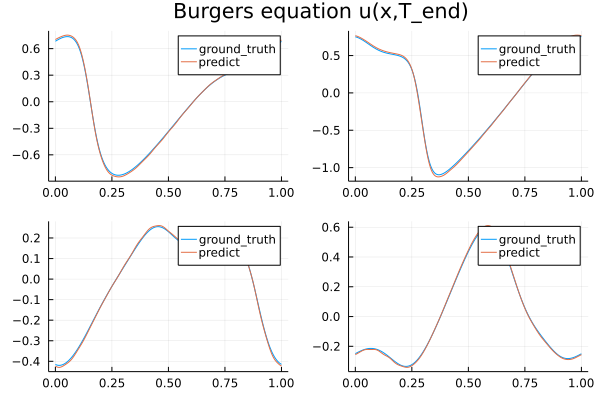

# Burgers' equation

In this example, a [Burgers' equation](https://en.wikipedia.org/wiki/Burgers%27_equation)
is learned by a one-dimensional Fourier neural operator network.

there is learn the operator mapping the initial condition to last point of time evolition of equation in some function space :

```math
u(x, 0) ->  u(x, t_end)\
```



Change directory to `example/Burgers` and use following commend to train model:

```julia
julia> using Burgers;
       Burgers.train();
$ julia --proj
```
