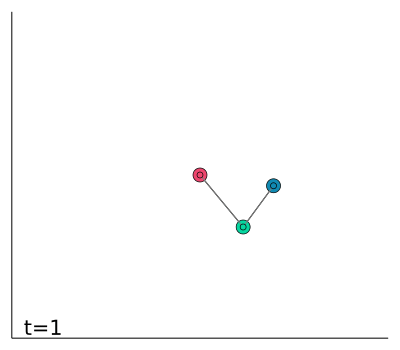

# Double pendulum

A [double pendulum](https://www.wikiwand.com/en/Double_pendulum) is a pendulum with another pendulum attached to its end.
In is example, instead of learning from a well-described equation of motion,
we train the model with the famous dataset provided by IBM.
The equation of motion to the real experiments of double pendulum is learned by a two-dimensional Fourier neural operator.
It learns to inference the next 30 steps with the given first 30 steps.
The result of this example can be found [here](https://neuraloperators.sciml.ai/dev/assets/notebook/double_pendulum.jl.html).



By inference the result recurrently, we can generate up to 150 steps with the first 30 initial steps.

Change directory to `example/DoublePendulum` and use following commend to train model:

```julia
$ julia --proj

julia> using DoublePendulum; DoublePendulum.train()
```
