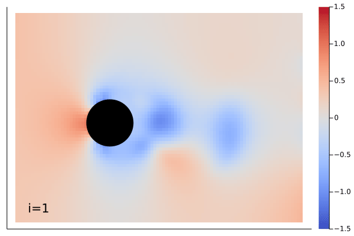

# Flow over the circle

The time dependent Navier-Stokes equation is learned by the `MarkovNeuralOperator` with only one time step information.
The result of this example can be found [here](https://neuraloperators.sciml.ai/dev/assets/notebook/mno.jl.html).

| **Ground Truth** | **Inferenced** |
|:----------------:|:--------------:|
|  |  |

Change directory to `example/FlowOverCircle` and use following commend to train model:

```julia
$ julia --proj

julia> using FlowOverCircle; FlowOverCircle.train()
```
